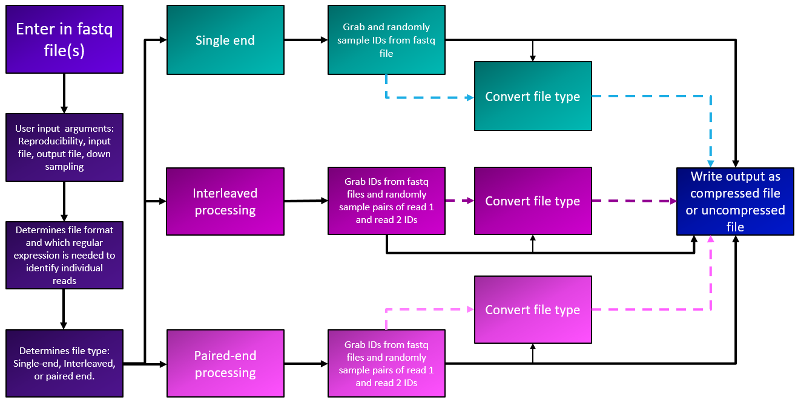

#  

[](https://github.com/nf-core/sylensmodule/actions?query=workflow%3A%22nf-core+CI%22)
[](https://github.com/nf-core/sylensmodule/actions?query=workflow%3A%22nf-core+linting%22)[](https://nf-co.re/sylensmodule/results)[](https://doi.org/10.5281/zenodo.XXXXXXX)

[](https://www.nextflow.io/)
[](https://docs.conda.io/en/latest/)
[](https://www.docker.com/)
[](https://sylabs.io/docs/)
[](https://tower.nf/launch?pipeline=https://github.com/nf-core/sylensmodule)

[](https://nfcore.slack.com/channels/sylensmodule)[](https://twitter.com/nf_core)[](https://mstdn.science/@nf_core)[](https://www.youtube.com/c/nf-core)

## Introduction

**nf-core/sylensmodule** is a bioinformatics module that is designed to intake **FASTQ** files and user inputs through [**argparse**](https://docs.python.org/3/library/argparse.html) and alter the FASTQ file output with [**Bio.SeqIO**](https://biopython.org/wiki/SeqIO). This program not only allows for file output conversions based on user preferences, but can randomly down sample FASTQ files that have millions of reads based on a user supplied integer or subsampled based on a percentage of reads.


Sylens works by analyzing the ID configuration of the supplied FASTQ file(s). Currently, Sylens can analyze NCBI, Illumina, and Casava formatted FASTQ files. The program then determines if the input file is an interleaved or single end file or processes paired end files. If subsampling is desired, it will randomly subsample the FASTQ files and generate a seed for the run. This seed can be used to reproduce results, if desired. File formatting can be converted to and from ASCII 64 (FASTQ-solexa) and ASCII 33 (sanger) formats. The files can be written in both compressed and uncompressed format. 

## Usage
If you are new to Nextflow and nf-core, please refer to [this page](https://nf-co.re/docs/usage/installation) on how
to set-up Nextflow. Make sure to [test your setup](https://nf-co.re/docs/usage/introduction#how-to-run-a-pipeline)
with `-profile test` before running the workflow on actual data.

Prepare a samplesheet with the input data as follows:

`samplesheet.csv`:

```csv
sample,fastq_1,fastq_2
CONTROL_REP1,AEG588A1_S1_L002_R1_001.fastq.gz,AEG588A1_S1_L002_R2_001.fastq.gz
```

Each row denotes which files are for an individual analysis. A row with one fastq file (single-end/interleaved) will be run through sylens as that one file. A row with a pair of fastq files (paired end) will be run through sylens together as paired end files. 

To run the module, use:

```bash
nextflow run nf-core/sylensmodule \
   -profile <docker/singularity/.../institute> \
   --input samplesheet.csv \
   --outdir <OUTDIR>
```

Sylens has a variety of parameters that can be added to customize the analysis. To find a comprehensive list, refer [here](https://github.com/evagunawan/SYLENS). To add parameters into the sylens module, use:

```bash
nextflow run nf-core/sylensmodule \
   -profile <docker/singularity/.../institute> \
   --input samplesheet.csv \
   --outdir <OUTDIR> \
   --subsample "-s 100" \
   --
```

:::warning
Please provide pipeline parameters via the CLI or Nextflow `-params-file` option. Custom config files including those
provided by the `-c` Nextflow option can be used to provide any configuration _**except for parameters**_;
see [docs](https://nf-co.re/usage/configuration#custom-configuration-files).
:::

For more details and further functionality, please refer to the [usage documentation](https://nf-co.re/sylensmodule/usage) and the [parameter documentation](https://nf-co.re/sylensmodule/parameters).

## Pipeline output

To see the results of an example test run with a full size dataset refer to the [results](https://nf-co.re/sylensmodule/results) tab on the nf-core website pipeline page.
For more details about the output files and reports, please refer to the
[output documentation](https://nf-co.re/sylensmodule/output).

## Credits

nf-core/sylensmodule was originally written by Eva Gunawan.

We thank the following people for their extensive assistance in the development of this pipeline:

<!-- TODO nf-core: If applicable, make list of people who have also contributed -->

## Contributions and Support

If you would like to contribute to this pipeline, please see the [contributing guidelines](.github/CONTRIBUTING.md).

For further information or help, don't hesitate to get in touch on the [Slack `#sylensmodule` channel](https://nfcore.slack.com/channels/sylensmodule) (you can join with [this invite](https://nf-co.re/join/slack)).

## Citations

<!-- TODO nf-core: Add citation for pipeline after first release. Uncomment lines below and update Zenodo doi and badge at the top of this file. -->
<!-- If you use nf-core/sylensmodule for your analysis, please cite it using the following doi: [10.5281/zenodo.XXXXXX](https://doi.org/10.5281/zenodo.XXXXXX) -->

<!-- TODO nf-core: Add bibliography of tools and data used in your pipeline -->

An extensive list of references for the tools used by the pipeline can be found in the [`CITATIONS.md`](CITATIONS.md) file.

You can cite the `nf-core` publication as follows:

> **The nf-core framework for community-curated bioinformatics pipelines.**
>
> Philip Ewels, Alexander Peltzer, Sven Fillinger, Harshil Patel, Johannes Alneberg, Andreas Wilm, Maxime Ulysse Garcia, Paolo Di Tommaso & Sven Nahnsen.
>
> _Nat Biotechnol._ 2020 Feb 13. doi: [10.1038/s41587-020-0439-x](https://dx.doi.org/10.1038/s41587-020-0439-x).
